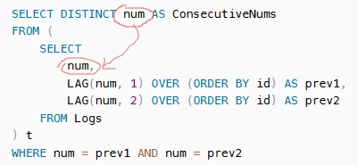

# 180. Consecutive Numbers

Table: Logs

| Column Name | Type    |
|:------------|:--------|
| id          | int     |
| num         | varchar |

In SQL, id is the primary key for this table.

id is an autoincrement column starting from 1.

Find all numbers that appear at least three times consecutively.

Return the result table in any order.

### Solution-1

```
# 思路：某一条记录等于上面一行和下面一行

SELECT DISTINCT num AS ConsecutiveNums
FROM Logs a
WHERE num = (SELECT num FROM Logs WHERE id = a.id + 1)
AND   num = (SELECT num FROM Logs WHERE id = a.id - 1)
```

---

### Solution-2

```
# 思路：用LAG()获取前两行的num

SELECT DISTINCT num AS ConsecutiveNums
FROM (
    SELECT 
        num,
        LAG(num, 1) OVER (ORDER BY id) AS prev1,
        LAG(num, 2) OVER (ORDER BY id) AS prev2
    FROM Logs
) t
WHERE num = prev1 AND num = prev2
```



prev1 为 num 的上一行，<br>
prev2 为 num 的上两行

`LAG()` 允许你访问当前行之前的行中的数据，而无需使用自连接(self-join)，从而加快查询速度

---

### Solution-3

```
# 思路：先通过DISTINCT去重，使用自连接

SELECT DISTINCT l1.num AS ConsecutiveNums
FROM Logs l1
JOIN Logs l2 ON l1.id = l2.id - 1
JOIN Logs l3 ON l2.id = l3.id - 1
WHERE l1.num = l2.num AND l2.num = l3.num;
```

两个 JOIN **递减**获取 num 的前一行和前两行，<br>
这样三个表连接后就形成连续的行