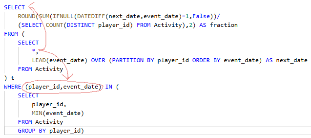

# 550. Game Play Analysis IV

Table: `Activity`

| Column Name  | Type    |
|:-------------|:--------|
| player_id    | int     |
| device_id    | int     |
| event_date   | date    |
| games_played | int     |

（`player_id`，`event_date`）是此表的主键（具有唯一值的列的组合）。

这张表显示了某些游戏的玩家的活动情况。<br>
每一行是一个玩家的记录，他在某一天使用某个设备注销之前登录并玩了很多游戏（可能是 0）。<br>
编写解决方案，报告在首次登录的第二天再次登录的玩家的 比率，四舍五入到小数点后两位。换句话说，你需要计算从首次登录后的第二天登录的玩家数量，并将其除以总玩家数。

### Solution-1

```
# 思路：计算每个用户首次登录后次日仍登录的比例（1/0值的平均值）

SELECT ROUND(AVG(a1.player_id IS NOT NULL), 2) AS fraction
FROM Activity a1 RIGHT JOIN (
    SELECT player_id, min(event_date) AS firstdate
    FROM Activity
    GROUP BY player_id
) a2
ON a1.player_id = a2.player_id AND DATEDIFF(a1.event_date, a2,firstdate) = 1
```

1. **子查询**：找出每个玩家的首次登录日期
2. **RIGHT JOIN连接**：将原始活动表与首次登录表连接
3. **AVG计算**：<br>
    `a1.player_id IS NOT NULL`在匹配成功时返回1，否则返回0

    假设有三个玩家：<br>

    - 玩家A：第1天登录，第2天也登录 → 1

    - 玩家B：第1天登录，第2天未登录 → 0

    - 玩家C：第1天登录，第2天也登录 → 1

    计算过程：
    ```
    (1 + 0 + 1) / 3 = 0.666...
    ROUND后显示为0.67
    ```

    ---

### Solution-2

```
-- 思路：按player_id取窗口，窗口内排序，统计第二次登录的时间next_date
--      找到每个player_id对应的首次登录时间event_date
--      统计datediff(next_date,event_date)=1的数量

SELECT
    ROUND(SUM(IFNULL(DATEDIFF(next_date,event_date)=1,False))/
    (SELECT COUNT(DISTINCT player_id) FROM Activity),2) AS fraction
FROM (
    SELECT
        *,
        LEAD(event_date) OVER (PARTITION BY player_id ORDER BY event_date) AS next_date
    FROM Activity
) t 
WHERE (player_id,event_date) IN (
    SELECT 
        player_id,
        MIN(event_date) 
    FROM Activity
    GROUP BY player_id)
```



1. `SUM` 函数统计有多少个 `IFNULL` 函数的值为1（True）：

    - 玩家A：第1天登录，第2天也登录 → 1

    - 玩家B：第1天登录，第2天未登录 → 0

    - 玩家C：第1天登录，第2天未登录 → 0

    计算过程：
    ```
    (1 + 0 + 1) / 3 = 0.333...
    ROUND后显示为0.33
    ```